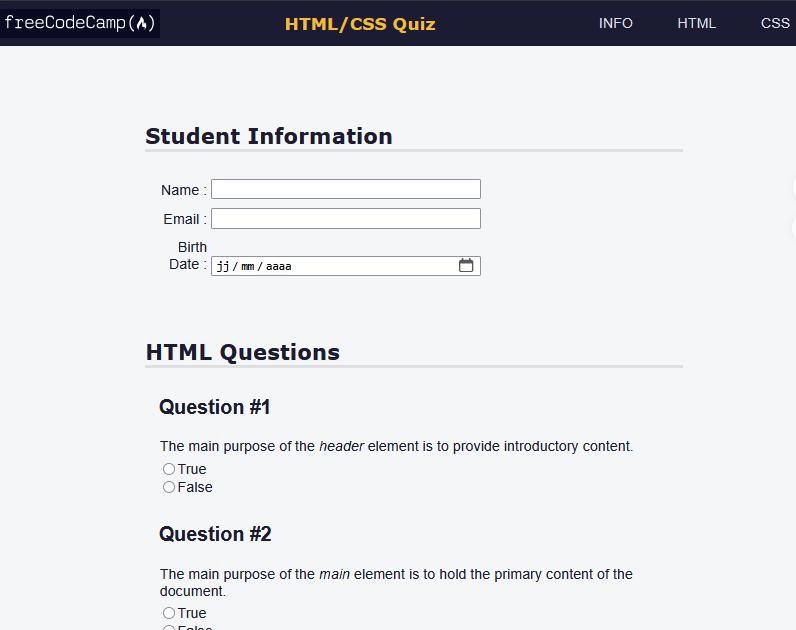

# Quiz Webpage

Page de quiz réalisée dans le parcours **freeCodeCamp — Responsive Web Design**. L'exercice met l'accent sur la construction d'un formulaire structuré et l'attention portée à l'accessibilité des champs et contrôles.

 

## Aperçu

## Compétences travaillées

- Structuration d'un formulaire HTML
- Utilisation de champs adaptés à différents types de réponses
- Organisation sémantique du contenu
- Prise en compte de l'accessibilité des formulaires
- Mise en forme avec CSS

## Technologies

- HTML5
- CSS3

## Démo

[Voir la démo en ligne](https://docaridr.github.io/quiz-webpage-freecodecamp/)

## Statut

**Projet terminé — exercice d'apprentissage freeCodeCamp.**

## Auteur

**Ricardo DOVONOU — DocariDR**

[GitHub](https://github.com/DocariDR) · [LinkedIn](https://www.linkedin.com/in/ricardo-dovonou)